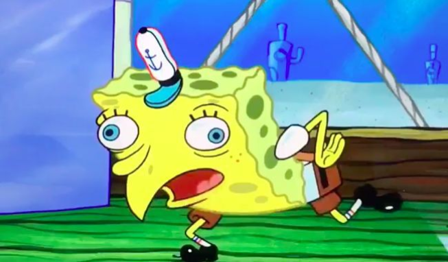

# Retarded sponge bob generator

Generate this mainstream meme easier, with one command line ! :joy::100::ok_hand:




## What's working

For now you can generate a *retarded* sentence just like sponge bob do, and either generate the meme, or getting the text output

```bash
./retard-bob -input="I'm not retarded, leave me alone" -text=false -out="retarded_bob.png"
```

this command will create an image `retarded_bob.png` with the string provided in `input`. If you prefer to only get the string, just put `text` to true.

The text is auto centered, you really just have to run one command :sunglasses:

## What needs to be done

- Arrange the assets to be available with the program
  - currently the program is only working in its directory
